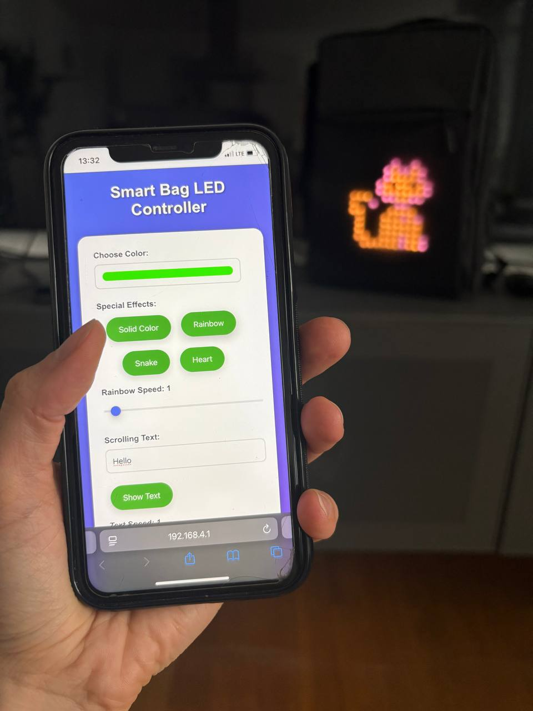
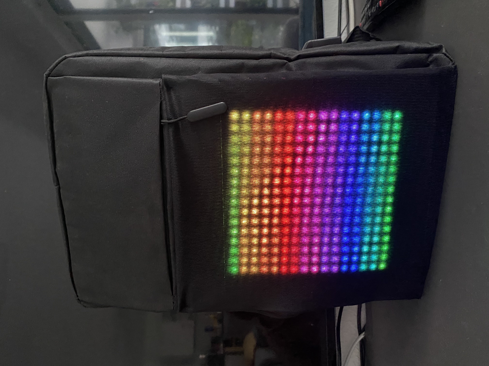

# Smart Bag LED Controller

A wireless LED matrix controller for ESP8266 that creates a "Smart Bag" with customizable LED effects, scrolling text, and image display through a web interface.

> **📚 Educational Project**: This is a school student project developed as part of learning embedded systems programming and IoT development with ESP8266 microcontrollers.

## 📸 Project Demo

<div align="center">

### Mobile Web Interface


*The responsive web interface running on a mobile device, showing the control panel with color picker, special effects buttons, and text input.*

### LED Matrix Display


*The 16x16 WS2812B LED matrix displaying a beautiful rainbow effect, integrated into a black bag.*

</div>

## 🎯 Features

- **Web-based Control Interface** - Modern, responsive web UI
- **Multiple LED Effects**:
  - Solid colors with color picker
  - Rainbow animation with speed control
  - Snake effect
  - Beating heart animation
- **Scrolling Text** - Custom text with adjustable speed
- **Image Display** - Pre-loaded images (Lion, Dinosaur, Koala, Gift)
- **WiFi Access Point** - Creates its own network for easy connection
- **Real-time Control** - Instant response to web commands

## 🛠 Hardware Requirements

- **ESP8266** (NodeMCU, Wemos D1 Mini, or similar)
- **16x16 WS2812B LED Matrix** (256 LEDs total)
- **Power Supply** - 5V, minimum 2A (recommended 3A for full brightness)
- **Jumper Wires** for connections

### Wiring Diagram

```
ESP8266 (NodeMCU)    →    LED Matrix
    D1 (GPIO5)       →    Data In (DIN)
    3V3              →    VCC (for signal level)
    GND              →    GND
    
External 5V PSU     →    LED Matrix VCC (for power)
External 5V PSU GND →    ESP8266 GND (common ground)
```

⚠️ **Important**: Use external 5V power supply for the LED matrix. ESP8266 3.3V cannot power 256 LEDs.

## 📦 Software Requirements

- [PlatformIO](https://platformio.org/) (recommended) or Arduino IDE
- [Visual Studio Code](https://code.visualstudio.com/) with PlatformIO extension

## 🚀 Building and Flashing

### Method 1: Using PlatformIO (Recommended)

1. **Clone the repository**:
   ```bash
   git clone https://github.com/sgetmanskaya/smartBagProject
   cd smartBagProject/SmartBagWebServer
   ```

2. **Open in VS Code**:
   ```bash
   code .
   ```

3. **Install dependencies** (automatic with PlatformIO):
   - FastLED library
   - ESP8266WiFi library
   - ESP8266WebServer library

4. **Build the project**:
   ```bash
   pio run
   ```

5. **Flash to ESP8266**:
   ```bash
   pio run --target upload
   ```

6. **Monitor serial output** (optional):
   ```bash
   pio device monitor
   ```

### Method 2: Using Arduino IDE

1. **Install ESP8266 Board Package**:
   - File → Preferences → Additional Board Manager URLs
   - Add: `http://arduino.esp8266.com/stable/package_esp8266com_index.json`
   - Tools → Board → Boards Manager → Search "ESP8266" → Install

2. **Install Required Libraries**:
   - Sketch → Include Library → Manage Libraries
   - Install: "FastLED" by Daniel Garcia

3. **Open the project**:
   - Open `src/main.cpp` in Arduino IDE

4. **Configure Board**:
   - Tools → Board → ESP8266 Boards → NodeMCU 1.0 (ESP-12E Module)
   - Tools → Port → Select your ESP8266 port

5. **Upload**:
   - Click Upload button

## 🌐 Network Connection

### Connecting to Smart Bag WiFi

1. **Power on your ESP8266** with the flashed firmware

2. **Look for WiFi network**:
   - **Network Name (SSID)**: `SmartBag`
   - **Password**: `12345678`

3. **Connect your device** (phone, laptop, tablet) to the `SmartBag` network

4. **Open web browser** and navigate to:
   ```
   http://192.168.4.1
   ```

5. **Serial Monitor Info** (if connected):
   ```
   === Smart Bag LED Controller ===
   SmartBag
   AP IP address: 192.168.4.1
   Open this URL in your browser to control the LEDs!
   Web server started on port 80
   System ready!
   ```

## 🎮 Web Interface Control

### Main Control Panel Features

#### 1. **Choose Color**
- Color picker for selecting custom colors
- Affects solid color mode and text color
- Real-time color preview

#### 2. **Special Effects** (4 Green Buttons)
- **Solid Color**: Fill entire matrix with selected color
- **Rainbow**: Animated rainbow effect with speed control
- **Snake**: LED snake animation using selected color  
- **Heart**: Beating heart animation (2:1 timing ratio)

#### 3. **Rainbow Speed Control**
- Slider: 1 (slowest) to 10 (fastest)
- Only affects rainbow animation speed
- Real-time adjustment

#### 4. **Scrolling Text**
- **Text Input**: Enter custom message (default: "Hello")
- **Show Text Button**: Apply text and start scrolling
- **Text Speed Slider**: 1 (slowest) to 3 (fastest)
- Uses selected color for text

#### 5. **Select Image**
- **Dropdown Options**:
  - Lion
  - Dinosaur  
  - Koala
  - Gift
- **Show Image Button**: Display selected image
- Pre-loaded 16x16 pixel art images

## 🔧 Configuration Options

### Network Settings (in `config.h`)
```cpp
const char* ssid = "SmartBag";        // Change WiFi name
const char* password = "12345678";    // Change WiFi password
```

### LED Settings (in `config.h`)
```cpp
#define NUM_LEDS 256          // Total LEDs (16x16)
#define DATA_PIN D1           // ESP8266 pin for LED data
#define BRIGHTNESS 50         // LED brightness (0-255)
#define WIDTH 16              // Matrix width
#define HEIGHT 16             // Matrix height
```

### Performance Settings
```cpp
#define VOLTS 5                      // Power supply voltage
#define MAX_CURRENT_MILLIAMPS 2000   // Current limit for safety
```

## 📁 Project Structure

```
SmartBagWebServer/
├── src/
│   ├── main.cpp              # Main application code
│   ├── config.h              # Configuration constants
│   ├── web_handlers.h/.cpp   # Web server request handlers
│   ├── image_processing.h    # LED matrix image functions
│   ├── text_processing.h     # Text rendering functions
│   ├── image_pixels.h        # Pre-loaded image data
│   └── fonts.h               # Font data for text rendering
├── platformio.ini            # PlatformIO configuration
└── README.md                 # This file
```

## 🎨 Customization

### Adding New Images
1. Convert image to 16x16 pixels
2. Generate RGB array data
3. Add to `image_pixels.h`
4. Update dropdown in `web_handlers.cpp`
5. Add case in `handleSetImage()`

### Adding New Effects
1. Add enum value to `ImageType` in `config.h`
2. Implement effect logic in `main.cpp` loop
3. Add button in `handleRoot()` HTML
4. Add case in `handleSetMode()`

### Changing Colors/Styling
- Modify CSS in `handleRoot()` function
- Customize button colors, gradients, layouts
- Add new UI elements as needed

## 📋 Technical Specifications

- **Microcontroller**: ESP8266 (80MHz, 4MB Flash)
- **LED Type**: WS2812B (Addressable RGB)
- **Matrix Size**: 16x16 (256 LEDs)
- **Power**: 5V, 2-3A recommended
- **WiFi**: 802.11 b/g/n Access Point mode
- **Web Server**: HTTP on port 80

## 📄 License

This project is open source. Feel free to modify and distribute according to your needs.

**Enjoy your Smart Bag LED Controller! 🎒✨**